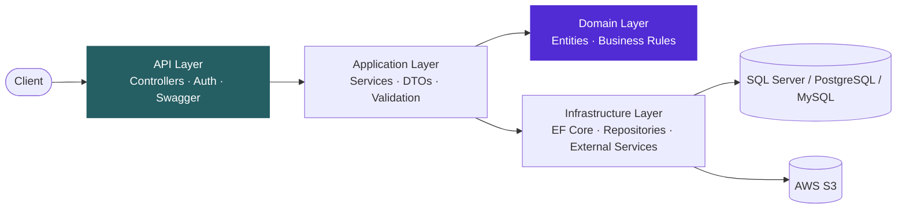
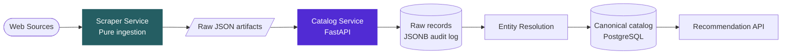

<!-- ===================== HEADER ===================== -->

  

---

## 👨‍💻 About Me

I'm a **Software Engineer** who designs and builds backend systems: APIs, real-time services, and data pipelines. **.NET** is my home base, but I pick tools by the problem, not the other way around, so my work spans **ASP.NET Core** APIs, **FastAPI** services, and **Node.js** event-driven architectures.

| | |
|---|---|
| 🧠 **Engineering mindset** | Frameworks change; fundamentals (data structures, design patterns, system design) are what transfer |
| 🔭 **Focusing on** | Microservices, high-traffic System Design, and deepening my expertise in **ASP.NET Core** |
| 🌱 **Philosophy** | Clean Code, SOLID principles, and pragmatic design patterns |
| 🚀 **Goal** | **Software Engineering / Backend internships** with real-world scalability and performance challenges |
| 🤝 **Teamwork** | Code reviews, shared learning, and agile delivery |

---

## 🛠️ Technical Arsenal

### ⚙️ Languages

### 🧩 Frameworks & Technologies

**.NET**

**Python**

**Node.js Ecosystem**

**Architecture & Concepts**

### 🗄️ Databases & Storage

### ☁️ Tools & Cloud

### 📚 Fundamentals
`Object-Oriented Programming` `Data Structures & Algorithms` `Design Patterns` `SOLID Principles`

---

## 🧠 Engineering Toolkit — What I Bring to a Software Team

<table>
  <tr>
    <td width="50%" valign="top">
      <h4>🔐 Secure Authentication</h4>
      JWT, ASP.NET Identity, and OAuth-based sign-in flows with token handling built for real-world use.
        
      <h4>⚡ Real-Time Communication</h4>
      Pushing live updates to clients with <b>SignalR</b> and WebSockets for responsive, event-driven experiences.
        
      <h4>🧱 Maintainable Architecture</h4>
      Clean Architecture, SOLID, and proven design patterns to keep codebases testable and easy to evolve.
        
      <h4>🧩 Service-Based Design</h4>
      Splitting systems into independent services with clear responsibilities and boundaries.
    </td>
    <td width="50%" valign="top">
      <h4>📡 API Design & Documentation</h4>
      RESTful endpoints that are consistent, well-structured, and documented with <b>Swagger</b> and tested with <b>Postman</b>.
        
      <h4>⏱️ Background Jobs & Performance</h4>
      Scheduled and async work using <b>Hangfire</b> and <b>RabbitMQ</b>, plus caching strategies with <b>Redis</b> to cut response times.
        
      <h4>🐳 Deployment & Storage</h4>
      Containerized with <b>Docker</b>, served behind <b>Nginx</b>, and file storage on <b>AWS S3</b>.
        
      <h4>🔄 Data Ingestion & Pipelines</h4>
      Collecting, normalizing, and persisting messy real-world data with <b>Python</b>, <b>FastAPI</b>, and <b>PostgreSQL</b>.
    </td>
  </tr>
</table>

### 🏛️ How I Structure Backend Systems

**Layered, with dependencies pointing inward** (my approach in .NET):

**Decoupled ingestion pipeline** (my approach in Python, target architecture of a project in progress):

> Different stacks, same principles: clear boundaries, single responsibilities, and business rules that don't depend on frameworks or delivery mechanisms.

---

## 🚧 Currently Building & Exploring

**Also leveling up on:**

* 🧬 **Microservices**: service boundaries, communication patterns, and resilience
* 📈 **System Design**: building for high traffic, scalability, and fault tolerance
* 🧮 **Problem Solving**: consistent practice on LeetCode and HackerRank

---

## 📊 GitHub Analytics

---

### 🤝 Let's Connect & Code!

⭐ Feel free to explore my repositories and reach out. I'm always open to learning, collaboration, and new challenges!
